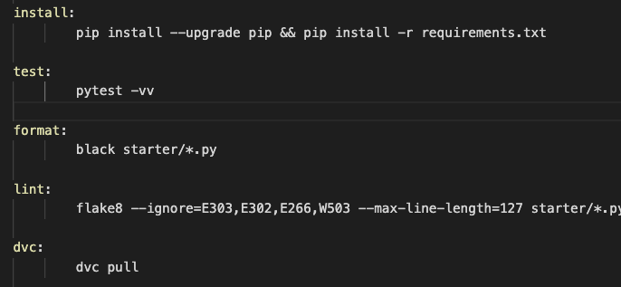
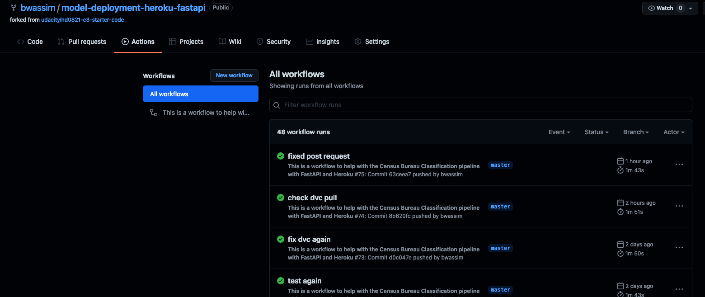
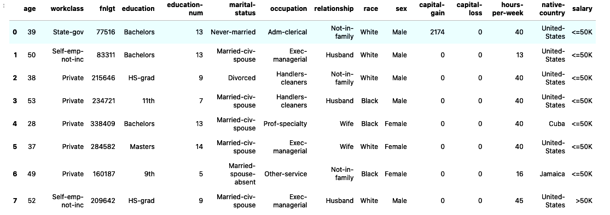
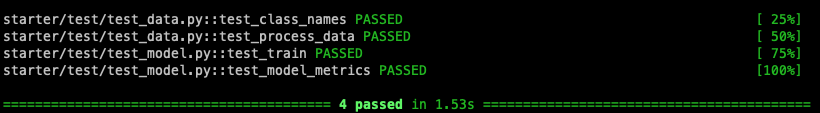

# ML Pipeline for Census Bureau Salary Classification
This project deploys a  CI/CD ML pipeline web app based on  the census 
bureau salary classification dataset.

Census Income Data Set: https://archive.ics.uci.edu/ml/datasets/census+income

## The pipeline leverages the use of 

- `Github Action`: for continuous integration and continuous deployment
- `DVC`: to manage the project dependencies (model, data, etc) and allow a reproducible pipeline
- `FastAPI`: for web app creation and serving
- `Heroku`: For continuos deployment of the created FastAPI app
---
## Environment Set up
While on the project root folder you can use `make setup` to create a conda environment
## Pipeline
The pipeline uses the yaml file in .github/workspace to configure all the necessary steps. The `Makefile` is used by `census-cy.yml` to describe the run command. 

conotinuous_integration.png

## Github Action 
The Github actions are triggered each time we push a new change to our repository.



# 1. Exploratory Data Analysis
The data consist of 32561 rows entries. The necessary steps for cleaning the data can be seen in the folling jupyter notebook [https://github.com/bwassim/model-deployment-heroku-fastapi/blob/master/starter/notebooks/EDA.ipynb](https://github.com/bwassim/model-deployment-heroku-fastapi/blob/master/starter/notebooks/EDA.ipynb)



The final script for cleaning our data is given by [clean_data.py](https://github.com/bwassim/model-deployment-heroku-fastapi/blob/master/starter/starter/clean_data.py)

# 2. Model
* I have chosen to start initially with a very simple model given by a `Logistic Regression` classifier from the scikit-learn library. Since the focus here was on the big picture of how to deploy a machine learning pipeline from start till the moment to query the endpoint with a POST request. 

To train the model run the following python code [train_model.py](https://github.com/bwassim/model-deployment-heroku-fastapi/blob/master/starter/starter/train_model.py)
The obtained scores are given below
```
     "precision": 0.7291280148423006,
     "recall"   : 0.24904942965779467,
     "fbeta"    : 0.37128011336797356
```
The results for model slicing can be found in [score_slices.json](https://github.com/bwassim/model-deployment-heroku-fastapi/blob/master/starter/model/score_slices.json)


# 3. Testing
In order to avoid erros that can make our pipeline fails, it is a good practice to include testing everywhere. After cleaning, the following tests on the data are applied

test_data:
  - `test_class_names`: Check that only the known classes are present 
  - `test_process_data`: Test the shape of the test data and make sure that the encoders are correctly retrieved.

test_model:
  -  `test_train`: tests the capacity of the train_model function to generate the  model 
  -  `test_model_metrics`: Test the model and evaluate it against the test data

> pytest starter/test -vv



# Data Version Control (DVC)
DVC is a complete solution for managing data, model, and the process of going from data to model. DVC uses GIT for versioning. It leverages a remote storage to hold the data and then tracks a record file using git (eg., `data.csv.dvc`)

Initialize and start dvc inside a git repository
> dvc init

Configure a remote storage (`AWS s3 remote bucket`)
> dvc remote add -d s3remote s3://census-bucket-udacity

Start tracking files 
> dvc add starter/data/census.csv 


*  Create a RESTful API using FastAPI this must implement:
    * GET on the root giving a welcome message.
    * POST that does model inference.
    * Type hinting must be used.
    * Use a Pydantic model to ingest the body from POST. This model should contain an example.
   	 * Hint: the data has names with hyphens and Python does not allow those as variable names. Do not modify the column names in the csv and instead use the functionality of FastAPI/Pydantic/etc to deal with this.
* Write 3 unit tests to test the API (one for the GET and two for POST, one that tests each prediction).

# API Deployment
* Create a free Heroku account (for the next steps you can either use the web GUI or download the Heroku CLI).
* Create a new app and have it deployed from your GitHub repository.
    * Enable automatic deployments that only deploy if your continuous integration passes.
    * Hint: think about how paths will differ in your local environment vs. on Heroku.
    * Hint: development in Python is fast! But how fast you can iterate slows down if you rely on your CI/CD to fail before fixing an issue. I like to run flake8 locally before I commit changes.
* Write a script that uses the requests module to do one POST on your live API.
