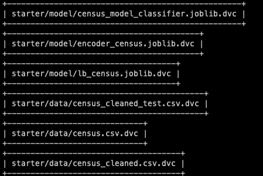
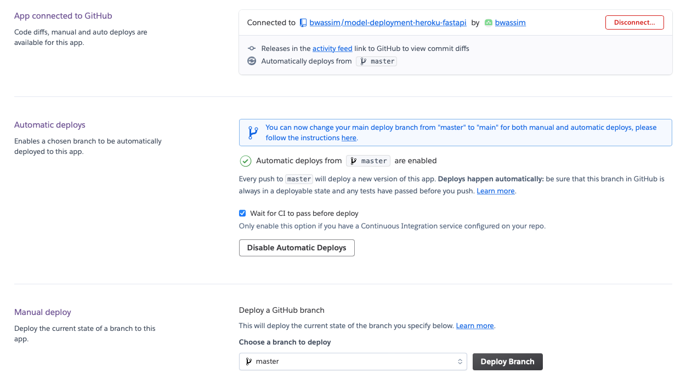
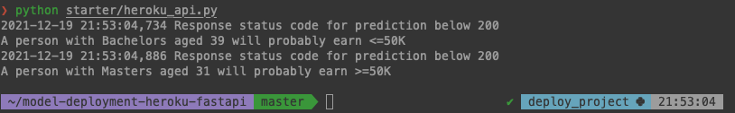

# ML Pipeline for Census Bureau Salary Classification
This project deploys a  CI/CD ML pipeline web app based on  the census 
bureau salary classification dataset.

Census Income Data Set: https://archive.ics.uci.edu/ml/datasets/census+income

## The pipeline leverages the use of 

- `Github Action`: for continuous integration and continuous deployment
- `DVC`: to manage the project dependencies (model, data, etc) and allow a reproducible pipeline
- `FastAPI`: for web app creation and serving
- `Heroku`: For continuos deployment of the created FastAPI app
---
## Environment Set up
While on the project root folder you can use `make setup` to create a conda environment
## Pipeline
The pipeline uses the yaml file in .github/workspace to configure all the necessary steps. The `Makefile` is used by `census-cy.yml` to describe the run command. 

conotinuous_integration.png

## Github Action 
The Github actions are triggered each time we push a new change to our repository.


## AWS Github configuration:
It is important to add a secret key on Github settings so that Github Action can connect to AWS with the correct credentials. That is 
> AWS_ACCESS_KEY_ID
>
> AWS_SECRET_ACCESS_KEY

These credentials can be found when first creating an Iam user on AWS plateform. Or it is even possible to generate new ones.

# 1. Exploratory Data Analysis
The data consist of 32561 rows entries. The necessary steps for cleaning the data can be seen in the folling jupyter notebook [https://github.com/bwassim/model-deployment-heroku-fastapi/blob/master/starter/notebooks/EDA.ipynb](https://github.com/bwassim/model-deployment-heroku-fastapi/blob/master/starter/notebooks/EDA.ipynb)


The final script for cleaning our data is given by [clean_data.py](https://github.com/bwassim/model-deployment-heroku-fastapi/blob/master/starter/starter/clean_data.py)

# 2. Model
* I have chosen to start initially with a very simple model given by a `Logistic Regression` classifier from the scikit-learn library. Since the focus here was on the big picture of how to deploy a machine learning pipeline from start till the moment to query the endpoint with a POST request. 

To train the model run the following python code [train_model.py](https://github.com/bwassim/model-deployment-heroku-fastapi/blob/master/starter/starter/train_model.py)
The obtained scores are given below
```
     "precision": 0.7291280148423006,
     "recall"   : 0.24904942965779467,
     "fbeta"    : 0.37128011336797356
```
The results for model slicing can be found in [score_slices.json](https://github.com/bwassim/model-deployment-heroku-fastapi/blob/master/starter/model/score_slices.json)


# 3. Testing
In order to avoid erros that can make our pipeline fails, it is a good practice to include testing everywhere. After cleaning, the following tests on the data are applied

test_data:
  - `test_class_names`: Check that only the known classes are present 
  - `test_process_data`: Test the shape of the test data and make sure that the encoders are correctly retrieved.

test_model:
  -  `test_train`: tests the capacity of the train_model function to generate the  model 
  -  `test_model_metrics`: Test the model and evaluate it against the test data

> pytest starter/test -vv


# Data Version Control (DVC)
DVC is a complete solution for managing data, model, and the process of going from data to model. DVC uses GIT for versioning. It leverages a remote storage to hold the data and then tracks a record file using git (eg., `data.csv.dvc`)

Initialize and start dvc inside a git repository
> dvc init

Configure a remote storage (`AWS s3 remote bucket`)
> dvc remote add -d s3remote s3://census-bucket-udacity

Start tracking files 
> dvc add starter/data/census.csv 

We can either  track each file seperately 



Or include all the steps in a dvc pipeline as described in [dvc.yml](https://github.com/bwassim/model-deployment-heroku-fastapi/blob/master/dvc.yaml) file


To retrieve the latest version of our data use 
> dvc pull -r s3remote 


or simply 
> dvc pull

It is also possible to use the DVC pipeline and use the following 
> dvc pull train_model

To run the complete dvc pipeline 
> dvc repro

# FastAPI
The [main.py](https://github.com/bwassim/model-deployment-heroku-fastapi/blob/master/starter/main.py) file contain the FastAPI app and all the function to execute a POST or GET request. For the post request, we need to provide the data as a json. To do the inference we need to convert the json data to a dataframe. 


To run the app locally, make sure the Procfile has the following config 
> web: uvicorn starter.main:app --host=127.0.0.1 --port=${PORT:-5000}

Then use

> heroku local
# API Test
Sample data are used to validate the prediction with post request. use the [test_main.py](https://github.com/bwassim/model-deployment-heroku-fastapi/blob/master/starter/test_main.py) with pytest as follows 

> pytest test_main.py -vv


# API Deployment

* For online deployment create a free Heroku account (for the next steps you can either use the web GUI or download the Heroku CLI).

* Create a new app, give it a name, e.g.,  `census-bureau-predict-salary`,  have it deployed from the GitHub repository.
* Enable automatic deployments that only deploy if the continuous integration passes.


* to allow heroku to use DVC follow the instruction on [dvc_on_heroku_instructions.md](https://github.com/bwassim/model-deployment-heroku-fastapi/blob/master/starter/dvc_on_heroku_instructions.md)
* 
Make sure to configure AWS credentials for heroku on the local terminal with 
> heroku config:set AWS_ACCESS_KEY_ID=[] AWS_SECRET_ACCESS_KEY=[] AWS_REGION=[]

or simply 
> heroku config

To track the deployment logs use on the local terminal 
> heroku logs --tail


- Once the app deployed you can launch queries with [heroku_api.py](https://github.com/bwassim/model-deployment-heroku-fastapi/blob/master/starter/heroku_api.py)

> python heroku_api.py 

and check the logs 
Once the app finishes the deployment with `build succeeded` message, it is possible to open the link on a browser on https://census-bureau-predict-salary.herokuapp.com/ and
run heroku_api.py


